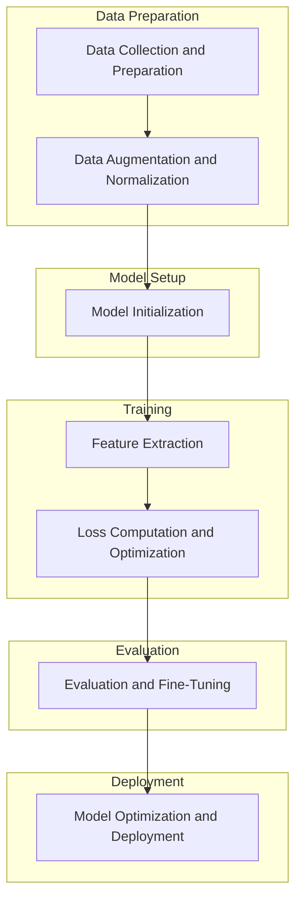

# DINOv2 Implementation for Custom BBU Dataset

## Objective
Implement and adapt DINOv2, a self-supervised learning framework, for industrial quality control image analysis, specifically focusing on the recognition of Baseband Unit (BBU) devices in telecommunications engineering.

## Table of Contents
1. [Overview of DINOv2](#overview-of-dinov2)
2. [Custom BBU Dataset](#custom-bbu-dataset)
   - [Directory Structure](#directory-structure)
   - [Annotations](#annotations)
3. [Project Focus](#project-focus)
4. [Codebase Structure and Key Modules](#codebase-structure-and-key-modules)
5. [Self-Supervised Learning with DINOv2](#self-supervised-learning-with-dinov2)
   - [1. Data Preparation and Augmentation](#1-data-preparation-and-augmentation)
   - [2. Model Architecture](#2-model-architecture)
   - [3. Training Process](#3-training-process)
   - [4. Evaluation and Fine-Tuning](#4-evaluation-and-fine-tuning)
   - [5. Optimization and Deployment](#5-optimization-and-deployment)
6. [Pipeline Sequence and Corresponding Code Components](#pipeline-sequence-and-corresponding-code-components)
7. [Training Procedure](#training-procedure)
   - [Overview](#overview)
   - [Steps Involved](#steps-involved)
   - [Multi-GPU Training Strategy](#multi-gpu-training-strategy)
   - [Checkpointing: Saving and Loading](#checkpointing-saving-and-loading)
   - [Loading Pretrained Weights](#loading-pretrained-weights)
   - [Fully Sharded Data Parallel (FSDP)](#fully-sharded-data-parallel-fsdp)
8. [Model Saving and Loading](#model-saving-and-loading)
9. [Flowchart Representation](#flowchart-representation)
10. [Configuration Files and Key Modules](#configuration-files-and-key-modules)
11. [Summary](#summary)

## Overview of DINOv2
DINOv2 leverages self-supervised learning to train vision transformers without labeled data, aiming to learn robust feature representations through its intricate architecture and training processes.

## Custom BBU Dataset

### Directory Structure
```
bbu_full_dataset/
    annotations/
        train.json
        val.json
        test.json
    train/
        <group_id>/
            <group_id>-0.jpeg
            <group_id>-1.jpeg
            <group_id>-2.jpeg
    val/
        <group_id>/
            <group_id>-0.jpeg
            <group_id>-1.jpeg
            <group_id>-2.jpeg
    test/
        <group_id>/
            <group_id>-0.jpeg
            <group_id>-1.jpeg
            <group_id>-2.jpeg
```

### Annotations
Each JSON annotation file (`train.json`, `val.json`, `test.json`) follows the structure:
```json
{
  "metainfo": {
    "classes": [
      "negative",
      "positive"
    ]
  },
  "data_list": [
    {
      "img_path": "train/1015272/1015272-0.jpeg",
      "gt_label": 0,
      "group_id": "1015272"
    },
    {
      "img_path": "train/1015272/1015272-1.jpeg",
      "gt_label": 0,
      "group_id": "1015272"
    },
    // ... additional image annotations ...
  ]
}
```
This structure groups images by `group_id`, facilitating effective training and evaluation for classifying images as positive or negative.

## Project Focus
- **Understand DINOv2's Architecture**: Gain a comprehensive understanding of DINOv2's components and their interactions.
- **Adapt Framework for Custom Dataset**: Modify the self-supervised learning framework to accommodate a custom industrial quality inspection dataset.
- **Optimize Feature Extraction**: Enhance feature extraction capabilities tailored specifically for manufacturing defect detection.

## Codebase Structure and Key Modules
- **`models/vision_transformer.py`**: Implements the ViT backbone with `DinoVisionTransformer`.
- **`hub/depthers.py` & `hub/backbones.py`**: Factory functions for depth heads and backbone models.
- **`train/ssl_meta_arch.py`**: Defines the `SSLMetaArch` class for the student-teacher training paradigm.
- **`train/train.py`**: Contains the training loop, data loading, and checkpoint management.
- **`eval/utils.py`**: Utilities for evaluation, including normalization wrappers.
- **`layers/dino_head.py`**: Defines the `DINOHead` class.
- **`loss/dino_clstoken_loss.py`**: Implements the `DINOLoss` class.
- **`dinov2/data/augmentations.py` & `dinov2/data/datasets/bbu_data.py`**: Handle data augmentation and dataset loading.
- **`run/train/train.py`**: Facilitates training job submissions.
- **Configuration Files (`dinov2/configs/*.yaml`)**: Manage hyperparameters and model settings.

## Self-Supervised Learning with DINOv2

### 1. Data Preparation and Augmentation
- **Data Augmentation**: Apply transformations to input images to create diverse views.
  - **Global Crops**: Larger, potentially distorted versions of input images.
  - **Local Crops**: Smaller, localized patches within images.
  - **Geometric Augmentations**: Random resized crops, horizontal flips.
  - **Color Distortions and Blurring**: Enhance robustness by varying color and applying Gaussian blur.
  - **Normalization**: Scale image data appropriately for model training.
- **Implementation**:
  - `dinov2/data/augmentations.py`: Implements the `DataAugmentationDINO` class.
  - `dinov2/data/datasets/bbu_data.py`: Defines the `BBUDataset` dataset class inherited from `ExtendedVisionDataset` for data loading and preprocessing.

### 2. Model Architecture
- **Vision Transformer (ViT) Backbone**:
  - **Patch Embedding**: Splits images into patches and embeds them into a higher-dimensional space.
  - **Positional Encoding**: Adds positional information to retain spatial relationships.
  - **Transformer Blocks**: Consist of multi-head self-attention layers and MLPs with LayerNorm and DropPath.
- **Teacher and Student Networks**:
  - **Teacher Network**: Momentum-updated version of the student, providing stable targets.
  - **Student Network**: Learns to predict the teacher's output through enhanced feature extraction.
- **Implementation**:
  - `models/vision_transformer.py`: Defines the `DinoVisionTransformer` class.
  - `hub/depthers.py` & `hub/backbones.py`: Provide factory functions like `dinov2_vitg14_ld` and `dinov2_vitg14`.
  - `layers/dino_head.py`: Defines the `DINOHead` class for projecting extracted features.

### 3. Training Process
- **Forward Pass**:
  1. **Input Augmentation**: Generate global and local augmented views.
  2. **Feature Extraction**: Pass images through student and teacher networks.
  3. **Projection Heads**: Map features into a common space.
- **Loss Calculation**:
  - **DINO Loss**: Measures consistency between student and teacher outputs using cross-entropy with soft labels.
  - **Regularization Losses**: Optional losses like Kullback-Leibler divergence.
- **Backward Pass and Optimization**:
  - **Gradient Calculation**: Compute gradients based on combined loss.
  - **Optimizer Step**: Update model parameters using optimizers like Adam or SGD.
  - **Momentum Update**: Update teacher network's parameters as a moving average of the student’s parameters.
- **Implementation**:
  - `train/ssl_meta_arch.py`: Handles student and teacher networks, loss computations, and optimizer configurations.
  - `train/train.py`: Contains the training loop, data loaders, schedulers, and checkpoint handling.
  - `loss/dino_clstoken_loss.py`: Implements the `DINOLoss` class.

### 4. Evaluation and Fine-Tuning
- **Feature Extraction**:
  - Use the trained student model to extract features from industrial images.
- **Logistic Regression**:
  - Train a linear classifier on extracted features for defect classification.
  - Utilize scripts like `eval/log_regression.py`.
- **Performance Metrics**:
  - Implement metrics such as accuracy, precision, recall, and F1-score.
  - Use `MetricLogger` and `MetricCollection` from `eval/utils.py`.
- **Implementation**:
  - `eval/utils.py`: Utility classes and functions for evaluation.
  - `eval/linear.py`: Main function for linear evaluations.
  - `eval/knn.py`: Implements k-NN evaluation methodology.

### 5. Optimization and Deployment
- **Model Optimization**:
  - Fine-tune hyperparameters based on evaluation results.
  - Implement techniques like knowledge distillation or model pruning.
- **Deployment**:
  - Integrate the trained model into industrial quality control pipelines.
  - Ensure real-time inference capabilities and scalability.
- **Implementation**:
  - `hub/decode_heads.py`: Defines decoding mechanisms for deployment tasks.
  - `run/train/train.py`: Handles training job submissions for deployment workflows.

## Pipeline Sequence and Corresponding Code Components
1. **Data Collection and Preparation**
   - `dinov2/data/datasets/bbu_data.py`
   - `dinov2/data/augmentations.py`
2. **Data Augmentation and Normalization**
   - `dinov2/data/augmentations.py`
3. **Model Initialization**
   - `models/vision_transformer.py`
   - `hub/depthers.py` & `hub/backbones.py`
4. **Feature Extraction**
   - `layers/dino_head.py`
   - `eval/utils.py`
5. **Loss Computation and Optimization**
   - `loss/dino_clstoken_loss.py`
   - `train/ssl_meta_arch.py`
   - `train/train.py`
6. **Evaluation and Fine-Tuning**
   - `eval/linear.py` & `eval/knn.py`
   - `eval/utils.py`
7. **Model Optimization and Deployment**
   - `hub/decode_heads.py`
   - `run/train/train.py`

## Training Procedure

### Overview
The training procedure in DINOv2 leverages self-supervised learning to train vision transformers without labeled data. It involves initializing teacher and student networks, applying data augmentations, computing losses, and updating model parameters.

### Steps Involved
1. **Data Loading and Augmentation**
   - Utilize `dinov2/data/loaders.py` for data loaders.
   - Apply augmentations using `DataAugmentationDINO` from `dinov2/data/augmentations.py`.
2. **Model Initialization**
   - Initialize student and teacher networks from `models/vision_transformer.py`.
   - Only the student model can load pretrained weights via the `student.pretrained_weights` parameter in `dinov2/configs/ssl_default_config.yaml`.
3. **Forward Pass**
   - Pass augmented images through both networks to extract features.
4. **Loss Computation**
   - Calculate DINO loss using `loss/dino_clstoken_loss.py`.
5. **Backward Pass and Optimization**
   - Compute gradients and update student parameters.
   - Update teacher parameters using a momentum-based approach.
6. **Checkpointing**
   - Save model checkpoints periodically.

### Multi-GPU Training Strategy

#### Overview
DINOv2 supports distributed training across multiple GPUs using PyTorch's Fully Sharded Data Parallel (FSDP) for efficient hardware utilization.

#### Implementation Details
1. **Initialization**
   - Set up the distributed backend and initialize the process group in `train/train.py`.
2. **Model Wrapping with FSDP**
   - Wrap student and teacher models with `FullyShardedDataParallel` (FSDP).
   ```python
   from dinov2.fsdp import FSDPCheckpointer
   checkpointer = FSDPCheckpointer(model, cfg.train.output_dir, optimizer=optimizer, save_to_disk=True)
   ```
3. **Sampler Configuration**
   - Use `SamplerType.SHARDED_INFINITE` for sharded sampling to prevent data overlap.
4. **Data Synchronization**
   - Ensure data loaders are synchronized to maintain training consistency.
5. **Optimization**
   - Aggregate gradients across GPUs before updating parameters.

#### Best Practices
- **Consistent State Management**: Ensure all ranks resume from the same epoch and iteration.
- **Atomic Checkpoint Saving**: Prevent corruption during interruptions.
- **Backup Checkpoints**: Regularly backup to avoid data loss.
- **Monitor Synchronization**: Verify synchronized training progression.

### Checkpointing: Saving and Loading

#### Loading Checkpoints

##### Step-by-Step Guide

1. **Identify Checkpoint Files**
   - Locate the checkpoint directory specified in `MODEL.WEIGHTS` (e.g., `dinov2/temp_logs/bbu_test/`).
   - This directory should contain sharded checkpoint files named as `model_{step}.rank_{rank}.pth` for each GPU rank.

2. **Configure Resuming**
   - Utilize the `--resume` flag in the training script to enable resuming from checkpoints.
   - In your training script (`train.sh`), ensure that `NO_RESUME` is set to `false`:
     ```bash
     NO_RESUME=false
     ```

3. **Utilize Training Script**
   - The `run/train/train.sh` script manages the resuming logic based on the `--no-resume` flag.
   - Ensure that the script references the correct configuration and output directory.

4. **Launch Training with Distributed Launcher**
   ```bash
   ./run/train/train.sh
   ```
   - This command will initiate the training process, automatically loading the latest checkpoints for each GPU rank.

5. **Verify Checkpoint Loading**
   - Monitor the training logs to confirm successful loading:
     ```
     [INFO] Rank 0: Resumed training from checkpoint dinov2/temp_logs/bbu_test/model_0011249.rank_0.pth at epoch 10, iteration 1000
     [INFO] Rank 1: Resumed training from checkpoint dinov2/temp_logs/bbu_test/model_0011249.rank_1.pth at epoch 10, iteration 1000
     # ... and so on for other ranks
     ```

6. **Continue Training**
   - Training will seamlessly resume from the last saved checkpoint, maintaining consistency across all GPU ranks.

### Loading Pretrained Weights

#### Loading Pretrained Checkpoints for Self-Supervised Training

To initialize the **student** model with pretrained weights and continue training on your customized dataset, follow these steps:

1. **Set `student.pretrained_weights` in Configuration**
   
   Update your configuration YAML (e.g., `dinov2/configs/ssl_default_config.yaml`) to include the path to the pretrained weights:
   
   ```yaml
   student:
     pretrained_weights: /path/to/pretrained/hub_student_weights.pth
   ```

2. **Ensure `MODEL.WEIGHTS` is Appropriately Set**
   
   - **For Training with Pretrained Weights**: Do not set `MODEL.WEIGHTS` or leave it empty to start training with the pretrained backbone.
     
     ```yaml
     MODEL:
       WEIGHTS: ''
     ```
   
   - **For Resuming Training from Checkpoints**: Set `MODEL.WEIGHTS` to the desired checkpoint directory.
     
     ```yaml
     MODEL:
       WEIGHTS: dinov2/temp_logs/bbu_test
     ```

3. **Configure Resuming Flags in Training Script**
   
   - **To Start Training with Pretrained Weights**:
     
     Ensure that `NO_RESUME=true` in your `train.sh`:
     
     ```bash
     NO_RESUME=true
     ```
   
   - **To Resume from Checkpoints**:
     
     Ensure that `NO_RESUME=false` in your `train.sh`:
     
     ```bash
     NO_RESUME=false
     ```

4. **Launch Training with the Correct Configuration**
   
   - **To Start with Pretrained Weights**:
     
     ```bash
     torchrun --nproc_per_node=4 dinov2/train/train.py \
       --config-file dinov2/configs/ssl_default_config.yaml \
       --output-dir dinov2/temp_logs/bbu_test \
       --no-resume
     ```
   
   - **To Resume from a Checkpoint**:
     
     ```bash
     torchrun --nproc_per_node=4 dinov2/train/train.py \
       --config-file dinov2/temp_logs/bbu_test/config.yaml
     ```
     *Note: The `--no-resume` flag is omitted to enable resuming.*

5. **Verify Initialization in Training Logs**
   
   - **For Pretrained Weights**:
     ```
     [INFO] Loaded pretrained weights from /path/to/pretrained/hub_student_weights.pth
     ```
   
   - **For Resuming Training**:
     ```
     [INFO] Rank 0: Resumed training from checkpoint dinov2/temp_logs/bbu_test/model_0011249.rank_0.pth at epoch 10, iteration 1000
     [INFO] Rank 1: Resumed training from checkpoint dinov2/temp_logs/bbu_test/model_0011249.rank_1.pth at epoch 10, iteration 1000
     # ... and so on for other ranks
     ```

#### Key Differences

| Feature                     | `MODEL.WEIGHTS`                              | `student.pretrained_weights`                         |
|-----------------------------|----------------------------------------------|-------------------------------------------------------|
| **Purpose**                 | Resume training from a specific checkpoint   | Initialize the student model with pretrained weights   |
| **Target Model**            | **Student** model's sharded checkpoints     | **Student** model's backbone                          |
| **Checkpoint Structure**    | Directory with sharded (`model_{step}.rank_{rank}.pth`) files or specific `.pth` file | Single `.pth` file containing the backbone weights     |
| **Usage Scenario**          | Continuing training or distributed evaluation | Enhancing model initialization with pre-trained data    |
| **Loading Mechanism**       | Handled by `FSDPCheckpointer` in `train/train.py` | Specified in `dinov2/configs/ssl_default_config.yaml` |

### Fully Sharded Data Parallel (FSDP)

The original DINOv2 implementation utilizes **Fully Sharded Data Parallel (FSDP)** to efficiently manage and distribute model parameters across multiple GPUs during training. Here's how to accommodate resuming training with FSDP:

1. **Update Configuration Files**: Ensure that your configuration YAML files are set correctly.
   
   - **For Resuming Training**:
     
     ```yaml
     MODEL:
       WEIGHTS: dinov2/temp_logs/bbu_test  # Directory with sharded checkpoints
     ```
   
   - **For Loading Pretrained Weights**:
     
     ```yaml
     MODEL:
       WEIGHTS: /path/to/pretrained/hub_student_weights.pth  # Path to a single .pth file
     ```

2. **Ensure `train/train.py` Handles Resuming Correctly**
   - The `FSDPCheckpointer.resume_or_load` method in `train/train.py` manages loading checkpoints based on the `resume` flag and `MODEL.WEIGHTS`.
   - **No Modifications to `train/train.py` Needed**: The existing implementation already satisfies the required functionality.

3. **Ensure Consistency Across Ranks**
   - All GPU ranks must have access to the correct `MODEL.WEIGHTS` path.
   - When resuming, `FSDPCheckpointer` automatically maps each GPU rank to its corresponding sharded checkpoint file.

4. **Test Resumption Mechanism**
   - **Save a Checkpoint**: Initiate a training run and allow it to save checkpoints periodically.
   - **Resume Training**: Run the training script with `NO_RESUME=false` and verify that training resumes from the last saved checkpoint.
   - **Verify Logs**: Ensure that each GPU rank logs a message indicating successful checkpoint loading.

---

## **Additional Clarifications**

### **1. How to Tell if `MODEL.WEIGHTS` Accepts Both Directory and `.pth` File Paths**

The acceptance of both directory paths and specific `.pth` file paths by `MODEL.WEIGHTS` is primarily determined by how the `resume_or_load` method in `FSDPCheckpointer` is implemented. Here's how you can identify this flexibility:

- **Directory Path Usage**:
  - When `MODEL.WEIGHTS` is set to a directory, the `resume_or_load` method searches for the `last_checkpoint.rank_{rank}.pth` file within that directory.
  - It then appropriately loads the corresponding sharded checkpoint file for each GPU rank.

- **Specific `.pth` File Path Usage**:
  - When `MODEL.WEIGHTS` points directly to a `.pth` file, the `resume_or_load` method treats it as a specific checkpoint file to load for the corresponding GPU rank.

**Code Insight**:

In the `FSDPCheckpointer` class (`dinov2/fsdp/__init__.py`), the `load` method within `resume_or_load` utilizes `super().load(*args, **kwargs)` from `fvcore.common.checkpoint.Checkpointer`. The `Checkpointer` class in `fvcore` is designed to handle both directory paths and specific file paths, thereby providing the necessary flexibility.

### **2. Practical Implications for Configuration**

- **Resuming Training**:
  - **Configuration**:
    ```yaml
    MODEL:
      WEIGHTS: dinov2/temp_logs/bbu_test  # Directory with sharded checkpoints
    ```
  - **Training Script (`train.sh`)**:
    ```bash
    NO_RESUME=false  # Enable resuming
    ```
  - **Behavior**:
    - Automatically loads the latest sharded checkpoints for each GPU rank from the specified directory.
    - Maintains synchronized training across all GPUs.

- **Loading Pretrained Weights**:
  - **Configuration**:
    ```yaml
    MODEL:
      WEIGHTS: /path/to/pretrained/hub_student_weights.pth  # Specific pretrained weights file
    ```
  - **Training Script (`train.sh`)**:
    ```bash
    NO_RESUME=true  # Disable resuming to load pretrained weights
    ```
  - **Behavior**:
    - Initializes the student model's backbone with the specified pretrained weights.
    - Does not attempt to load any sharded checkpoints, effectively starting fresh training with the pretrained initialization.

---

## **Conclusion**

Understanding the distinct roles of `MODEL.WEIGHTS` and `student.pretrained_weights` is crucial for effectively managing training workflows in the `dinov2` codebase:

- **Use `MODEL.WEIGHTS`** to **resume training** from sharded checkpoints in a distributed setup.
- **Use `student.pretrained_weights`** to **initialize the student model** with pretrained weights before starting or continuing training.

The `MODEL.WEIGHTS` parameter's versatility in accepting both directory paths and specific `.pth` file paths, combined with the robust implementation of the `FSDPCheckpointer`, ensures seamless integration for both resuming training and initializing with pretrained weights.

By following the outlined configurations and best practices, you can efficiently manage training states, leverage pretrained models, and maintain consistency across distributed training environments.

Feel free to reach out if you need further assistance or additional clarifications!

## Model Saving and Loading

### Saving Models

DINOv2 employs **Fully Sharded Data Parallel (FSDP)** to efficiently manage and distribute model parameters across multiple GPUs during training. This approach enables scalable training of large models by sharding parameters and optimizer states.

#### Student Model Checkpoints
- **Format**: `model_{step}.rank_{rank}.pth`
- **Description**: These are sharded checkpoints of the **student** model, where `{step}` denotes the training iteration, and `{rank}` represents the GPU rank.
- **Saving Mechanism**:
  - Managed by the `FSDPCheckpointer` class within `train/train.py`.
  - Periodically saved based on the `saveckp_freq` configuration.

#### Teacher Model Checkpoints
- **File Name**: `teacher_checkpoint.pth`
- **Description**: This checkpoint contains the state dictionary of the **teacher** model, which is an Exponential Moving Average (EMA) of the student model. The teacher provides stable targets for self-supervised learning.
- **Saving Mechanism**:
  - Handled by the evaluation functions in `train/train.py` during evaluation phases.
  - Saved under the directory structure: `/eval/training_{epoch}/teacher_checkpoint.pth`.

### Loading Models

#### Loading Sharded Student Model Checkpoints
To resume training or perform distributed evaluation, load the sharded student checkpoints by setting the `MODEL.WEIGHTS` parameter in your configuration to the desired checkpoint path. For multi-GPU setups, ensure that `MODEL.WEIGHTS` points to the directory containing all rank-specific checkpoint files.

```yaml
MODEL:
  WEIGHTS: dinov2/temp_logs/bbu_test/model_checkpoint.rank_{rank}.pth
```

Ensure that `train/train.py` correctly handles loading the checkpoint as demonstrated in the [Checkpointing: Saving and Loading](#checkpointing-saving-and-loading) section.

#### Loading Teacher Model Checkpoints
Teacher model checkpoints are automatically managed during evaluation phases. Ensure that the checkpoint paths are correctly specified in the evaluation configurations if custom handling is required.

## Configuration Files and Key Modules
- **`optim.epochs`**: Specifies the total number of training epochs. This determines how many times the entire dataset is processed during the training phase.
- **`train.OFFICIAL_EPOCH_LENGTH`**: Defines the number of iterations per epoch when using the `InfiniteSampler` setting. For example, setting `OFFICIAL_EPOCH_LENGTH=500` with `batch_size_per_gpu=64` serves as a baseline for further tuning to control the total number of training iterations.

## Flowchart Representation

**Explanation:**
1. **Data Collection and Preparation**: Gather and prepare industrial quality control images.
2. **Data Augmentation and Normalization**: Apply augmentations to enhance data diversity and normalize inputs.
3. **Model Initialization**: Initialize teacher and student vision transformer models.
4. **Feature Extraction**: Extract features using the student model and project them into latent space.
5. **Loss Computation and Optimization**: Calculate DINO loss and update model parameters through optimization.
6. **Evaluation and Fine-Tuning**: Assess model performance using linear classifiers and k-NN evaluations.
7. **Model Optimization and Deployment**: Optimize the model for deployment, integrating it into pipelines for real-time inference.

## Summary
This document outlines the implementation and adaptation of DINOv2 for a custom BBU dataset, focusing on the recognition of Baseband Unit (BBU) devices in telecommunications engineering. It details the dataset structure, project focus, self-supervised learning components, codebase structure, training procedures, multi-GPU strategies, checkpointing mechanisms, and the model architecture. By following these guidelines, effective utilization of DINOv2 for industrial quality control image analysis can be achieved, ensuring robust feature extraction and scalable deployment.
