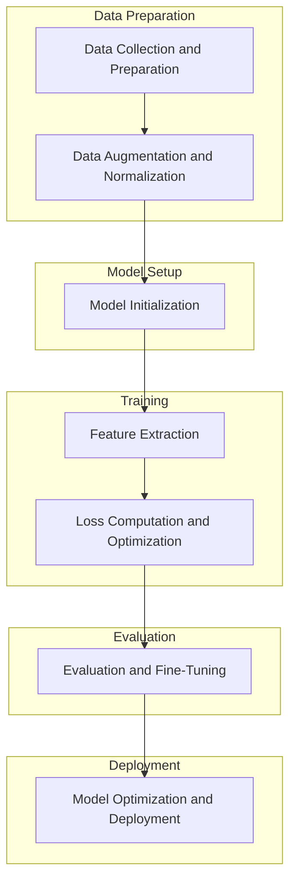

# DINOv2 Implementation for Custom Industrial Dataset

## Objective
Implement and adapt DINOv2, a self-supervised learning framework, for industrial quality control image analysis.

## Table of Contents
1. [Overview of DINOv2](#overview-of-dinov2)
2. [Custom Industrial Dataset](#custom-industrial-dataset)
   - [Directory Structure](#directory-structure)
   - [Annotations](#annotations)
3. [Project Focus](#project-focus)
4. [Self-Supervised Learning with DINOv2](#self-supervised-learning-with-dinov2)
   - [Data Preparation and Augmentation](#1-data-preparation-and-augmentation)
   - [Model Architecture](#2-model-architecture)
   - [Training Process](#3-training-process)
   - [Evaluation and Fine-Tuning](#4-evaluation-and-fine-tuning)
   - [Optimization and Deployment](#5-optimization-and-deployment)
5. [Codebase Structure](#codebase-structure-and-key-modules)
6. [Pipeline Sequence](#pipeline-sequence-and-corresponding-code-components)
7. [Flowchart Representation](#flowchart-representation)
8. [Training Procedure](#training-procedure)
   - [Overview](#overview)
   - [Steps Involved](#steps-involved)
   - [Multi-GPU Training Strategy](#multi-gpu-training-strategy)
   - [Checkpointing: Saving and Loading](#checkpointing-saving-and-loading)
   - [Loading Pretrained Weights](#loading-pretrained-or-existing-weights)
   - [Fully Sharded Data Parallel (FSDP)](#fully-sharded-data-parallel-fsdp)
9. [Model Architecture](#model-architecture)
10. [Summary](#summary)

## Overview of DINOv2
DINOv2 leverages self-supervised learning to train vision transformers without labeled data, aiming to learn robust feature representations through its intricate architecture and training processes.

## Custom Industrial Dataset

### Directory Structure
```
bbu_full_dataset/
    annotations/
        train.json
        val.json
        test.json
    train/
        <group_id>/
            <group_id>-0.jpeg
            <group_id>-1.jpeg
            <group_id>-2.jpeg
    val/
        <group_id>/
            <group_id>-0.jpeg
            <group_id>-1.jpeg
            <group_id>-2.jpeg
    test/
        <group_id>/
            <group_id>-0.jpeg
            <group_id>-1.jpeg
            <group_id>-2.jpeg
```

### Annotations
Each JSON annotation file (`train.json`, `val.json`, `test.json`) follows the structure:
```json
{
  "metainfo": {
    "classes": [
      "negative",
      "positive"
    ]
  },
  "data_list": [
    {
      "img_path": "train/1015272/1015272-0.jpeg",
      "gt_label": 0,
      "group_id": "1015272"
    },
    {
      "img_path": "train/1015272/1015272-1.jpeg",
      "gt_label": 0,
      "group_id": "1015272"
    },
    // ... additional image annotations ...
  ]
}
```
This structure groups images by `group_id`, facilitating effective training and evaluation for classifying images as positive or negative.

## Project Focus
- **Understand DINOv2's Architecture**: Gain a comprehensive understanding of DINOv2's components and their interactions.
- **Adapt Framework for Custom Dataset**: Modify the self-supervised learning framework to accommodate a custom industrial quality inspection dataset.
- **Optimize Feature Extraction**: Enhance feature extraction capabilities tailored specifically for manufacturing defect detection.

## Self-Supervised Learning with DINOv2

### 1. Data Preparation and Augmentation
- **Data Augmentation**: Apply transformations to input images to create diverse views.
  - **Global Crops**: Larger, potentially distorted versions of input images.
  - **Local Crops**: Smaller, localized patches within images.
  - **Geometric Augmentations**: Random resized crops, horizontal flips.
  - **Color Distortions and Blurring**: Enhance robustness by varying color and applying Gaussian blur.
  - **Normalization**: Scale image data appropriately for model training.
- **Implementation**:
  - `data/augmentations.py`: Implements the `DataAugmentationDINO` class.
  - `data/datasets/image_net.py`: Defines the `ImageNet22k` dataset class for data loading and preprocessing.

### 2. Model Architecture
- **Vision Transformer (ViT) Backbone**:
  - **Patch Embedding**: Splits images into patches and embeds them into a higher-dimensional space.
  - **Positional Encoding**: Adds positional information to retain spatial relationships.
  - **Transformer Blocks**: Consist of multi-head self-attention layers and MLPs with LayerNorm and DropPath.
- **Teacher and Student Networks**:
  - **Teacher Network**: Momentum-updated version of the student, providing stable targets.
  - **Student Network**: Learns to predict the teacher's output through enhanced feature extraction.
- **Implementation**:
  - `models/vision_transformer.py`: Defines the `DinoVisionTransformer` class.
  - `hub/depthers.py` & `hub/backbones.py`: Provide factory functions like `dinov2_vitg14_ld` and `dinov2_vitg14`.
  - `layers/dino_head.py`: Defines the `DINOHead` class for projecting extracted features.

### 3. Training Process
- **Forward Pass**:
  1. **Input Augmentation**: Generate global and local augmented views.
  2. **Feature Extraction**: Pass images through student and teacher networks.
  3. **Projection Heads**: Map features into a common space.
- **Loss Calculation**:
  - **DINO Loss**: Measures consistency between student and teacher outputs using cross-entropy with soft labels.
  - **Regularization Losses**: Optional losses like Kullback-Leibler divergence.
- **Backward Pass and Optimization**:
  - **Gradient Calculation**: Compute gradients based on combined loss.
  - **Optimizer Step**: Update model parameters using optimizers like Adam or SGD.
  - **Momentum Update**: Update teacher network's parameters as a moving average of the student’s parameters.
- **Implementation**:
  - `train/ssl_meta_arch.py`: Handles student and teacher networks, loss computations, and optimizer configurations.
  - `train/train.py`: Contains the training loop, data loaders, schedulers, and checkpoint handling.
  - `loss/dino_clstoken_loss.py`: Implements the `DINOLoss` class.

### 4. Evaluation and Fine-Tuning
- **Feature Extraction**:
  - Use the trained student model to extract features from industrial images.
- **Logistic Regression**:
  - Train a linear classifier on extracted features for defect classification.
  - Utilize scripts like `eval/log_regression.py`.
- **Performance Metrics**:
  - Implement metrics such as accuracy, precision, recall, and F1-score.
  - Use `MetricLogger` and `MetricCollection` from `eval/utils.py`.
- **Implementation**:
  - `eval/utils.py`: Utility classes and functions for evaluation.
  - `eval/linear.py`: Main function for linear evaluations.
  - `eval/knn.py`: Implements k-NN evaluation methodology.

### 5. Optimization and Deployment
- **Model Optimization**:
  - Fine-tune hyperparameters based on evaluation results.
  - Implement techniques like knowledge distillation or model pruning.
- **Deployment**:
  - Integrate the trained model into industrial quality control pipelines.
  - Ensure real-time inference capabilities and scalability.
- **Implementation**:
  - `hub/decode_heads.py`: Defines decoding mechanisms for deployment tasks.
  - `run/train/train.py`: Handles training job submissions for deployment workflows.

## Codebase Structure and Key Modules
- **`models/vision_transformer.py`**: Implements the ViT backbone with `DinoVisionTransformer`.
- **`hub/depthers.py` & `hub/backbones.py`**: Factory functions for depth heads and backbone models.
- **`train/ssl_meta_arch.py`**: Defines the `SSLMetaArch` class for the student-teacher training paradigm.
- **`train/train.py`**: Contains the training loop, data loading, and checkpoint management.
- **`eval/utils.py`**: Utilities for evaluation, including normalization wrappers.
- **`layers/dino_head.py`**: Defines the `DINOHead` class.
- **`loss/dino_clstoken_loss.py`**: Implements the `DINOLoss` class.
- **`data/augmentations.py` & `data/datasets/image_net.py`**: Handle data augmentation and dataset loading.
- **`run/train/train.py`**: Facilitates training job submissions.
- **Configuration Files (`configs/*.yaml`)**: Manage hyperparameters and model settings.

## Pipeline Sequence and Corresponding Code Components
1. **Data Collection and Preparation**
   - `data/datasets/image_net.py`
   - `data/augmentations.py`
2. **Data Augmentation and Normalization**
   - `data/augmentations.py`
3. **Model Initialization**
   - `models/vision_transformer.py`
   - `hub/depthers.py` & `hub/backbones.py`
4. **Feature Extraction**
   - `layers/dino_head.py`
   - `eval/utils.py`
5. **Loss Computation and Optimization**
   - `loss/dino_clstoken_loss.py`
   - `train/ssl_meta_arch.py`
   - `train/train.py`
6. **Evaluation and Fine-Tuning**
   - `eval/linear.py` & `eval/knn.py`
   - `eval/utils.py`
7. **Model Optimization and Deployment**
   - `hub/decode_heads.py`
   - `run/train/train.py`

## Flowchart Representation

**Explanation:**
1. **Data Collection and Preparation**: Gather and prepare industrial quality control images.
2. **Data Augmentation and Normalization**: Apply augmentations to enhance data diversity and normalize inputs.
3. **Model Initialization**: Initialize teacher and student vision transformer models.
4. **Feature Extraction**: Extract features using the student model and project them into latent space.
5. **Loss Computation and Optimization**: Calculate DINO loss and update model parameters through optimization.
6. **Evaluation and Fine-Tuning**: Assess model performance using linear classifiers and k-NN evaluations.
7. **Model Optimization and Deployment**: Optimize the model for deployment, integrating it into pipelines for real-time inference.

## Training Procedure

### Overview
The training procedure in DINOv2 leverages self-supervised learning to train vision transformers without labeled data. It involves initializing teacher and student networks, applying data augmentations, computing losses, and updating model parameters.

### Steps Involved
1. **Data Loading and Augmentation**
   - Utilize `dinov2/data/loaders.py` for data loaders.
   - Apply augmentations using `DataAugmentationDINO` from `dinov2/data/augmentations.py`.
2. **Model Initialization**
   - Initialize student and teacher networks from `models/vision_transformer.py`.
   - Only the student model can load pretrained weights via the `pretrained_weights` parameter in `ssl_default_config.yaml`.
3. **Forward Pass**
   - Pass augmented images through both networks to extract features.
4. **Loss Computation**
   - Calculate DINO loss using `loss/dino_clstoken_loss.py`.
5. **Backward Pass and Optimization**
   - Compute gradients and update student parameters.
   - Update teacher parameters using a momentum-based approach.
6. **Checkpointing**
   - Save model checkpoints periodically.

### Multi-GPU Training Strategy

#### Overview
DINOv2 supports distributed training across multiple GPUs using PyTorch's Fully Sharded Data Parallel (FSDP) for efficient hardware utilization.

#### Implementation Details
1. **Initialization**
   - Set up the distributed backend and initialize the process group in `train/train.py`.
2. **Model Wrapping with FSDP**
   - Wrap student and teacher models with `FullyShardedDataParallel` (FSDP).
   ```python
   from dinov2.fsdp import FSDPCheckpointer
   checkpointer = FSDPCheckpointer(model, cfg.train.output_dir, optimizer=optimizer, save_to_disk=True)
   ```
3. **Sampler Configuration**
   - Use `SamplerType.SHARDED_INFINITE` for sharded sampling to prevent data overlap.
4. **Data Synchronization**
   - Ensure data loaders are synchronized to maintain training consistency.
5. **Optimization**
   - Aggregate gradients across GPUs before updating parameters.

#### Best Practices
- **Consistent State Management**: Ensure all ranks resume from the same epoch and iteration.
- **Atomic Checkpoint Saving**: Prevent corruption during interruptions.
- **Backup Checkpoints**: Regularly backup to avoid data loss.
- **Monitor Synchronization**: Verify synchronized training progression.

### Checkpointing: Saving and Loading

#### Saving Checkpoints
Managed in `train/train.py` using `FSDPCheckpointer` to save model, optimizer, and scheduler states periodically.
```python
if iteration % config['train']['saveckp_freq'] == 0:
    checkpoint = {
        'epoch': epoch,
        'iteration': iteration,
        'student_state_dict': student.state_dict(),
        'teacher_state_dict': teacher.state_dict(),
        'optimizer_state_dict': optimizer.state_dict(),
        'scheduler_state_dict': scheduler.state_dict(),
    }
    torch.save(checkpoint, os.path.join(config['train']['output_dir'], f'checkpoint_{iteration}.pth'))
```

#### Loading Checkpoints
Handled in `train/train.py` where each process loads its corresponding checkpoint based on rank.
```python
checkpoint_path = config['train']['resume_path'].format(rank=rank)

if config.train.resume:
    if os.path.isfile(checkpoint_path):
        checkpoint = torch.load(checkpoint_path, map_location=f'cuda:{rank}')
        student.load_state_dict(checkpoint['student_state_dict'])
        teacher.load_state_dict(checkpoint['teacher_state_dict'])
        optimizer.load_state_dict(checkpoint['optimizer_state_dict'])
        scheduler.load_state_dict(checkpoint['scheduler_state_dict'])
        start_epoch = checkpoint['epoch']
        iteration = checkpoint['iteration']
        logger.info(f"Rank {rank}: Resumed training from checkpoint {checkpoint_path} at epoch {start_epoch}, iteration {iteration}")
    else:
        logger.error(f"Rank {rank}: No checkpoint found at {checkpoint_path}")
        raise FileNotFoundError(f"No checkpoint found at {checkpoint_path}")
```

#### Step-by-Step Guide
1. **Identify Checkpoint Files**
   - Locate in `output_dir` (e.g., `/data/training_code/Pein/dinov2/temp_logs/bbu_test/`).
2. **Modify Configuration for Resuming**
   ```yaml
   train:
     resume: true
     resume_path: /data/training_code/Pein/dinov2/temp_logs/bbu_test/model_0011249.rank_{rank}.pth
   ```
3. **Utilize Training Script**
   - `train/train.py` handles loading based on rank.
4. **Launch Training with Distributed Launcher**
   ```bash
   torchrun --nproc_per_node=4 train/train.py --config /data/training_code/Pein/dinov2/temp_logs/bbu_test/config.yaml
   ```
5. **Verify Checkpoint Loading**
   - Check training logs for successful loading messages.
6. **Continue Training**

#### Best Practices
- **Consistent State Across Ranks**
- **Atomic Saving**
- **Backup Checkpoints**
- **Monitor Synchronization**

### Loading Pretrained or Existing Weights

#### `MODEL.WEIGHTS`

- **Description**: `MODEL.WEIGHTS` refers to the path to the **student** model's checkpoint file (`model_{step}.rank_{rank}.pth`). This is typically used to resume training from a specific checkpoint or to initialize the model with previously saved weights.
- **Usage**:
  - **Resuming Training**: When you set `MODEL.WEIGHTS` to a specific checkpoint, the training process will load the sharded student model weights corresponding to each GPU rank.
  - **Format**: `model_{step}.rank_{rank}.pth`, where `{step}` is the training iteration and `{rank}` is the GPU rank.

#### `student.pretrained_weights`

- **Description**: `student.pretrained_weights` is a configuration parameter that allows you to initialize the **student** model with weights from a pretrained DINOv2 backbone. This is useful when you want to leverage a model that has been pre-trained on a large dataset to improve performance on your custom dataset.
- **Usage**:
  - **Initializing with Pretrained Weights**: By setting `student.pretrained_weights` to the path of a pretrained DINOv2 backbone, the student model will load these weights before starting training.
  - **Configuration Example**:
    ```yaml
    student:
      pretrained_weights: /path/to/pretrained/student_weights.pth
    ```
  - **Note**: The teacher model is an Exponential Moving Average (EMA) of the student model and does not require separate pretrained weights. It will be initialized based on the student model's parameters.

#### Key Differences

| Feature                     | `MODEL.WEIGHTS`                               | `student.pretrained_weights`                       |
|-----------------------------|-----------------------------------------------|-----------------------------------------------------|
| **Purpose**                 | Resume training from a specific checkpoint    | Initialize the student model with pretrained weights |
| **Target Model**            | **Student** model's sharded checkpoints      | **Student** model's backbone                        |
| **Checkpoint Structure**    | Sharded (`model_{step}.rank_{rank}.pth`)      | Single file containing the backbone weights          |
| **Usage Scenario**          | Continuing training or distributed evaluation | Enhancing model initialization with pre-trained data |
| **Loading Mechanism**       | Handled by `FSDPCheckpointer` in `train.py`    | Specified in `ssl_default_config.yaml`              |

#### Using a Pretrained DINOv2 Backbone

If you want to utilize a pretrained DINOv2 backbone for your student model, follow these steps:

1. **Set `student.pretrained_weights` in Configuration**
   
   Update your configuration YAML (e.g., `ssl_default_config.yaml`) to include the path to the pretrained weights:
   
   ```yaml
   student:
     pretrained_weights: /path/to/pretrained/student_weights.pth
   ```

2. **Ensure `MODEL.WEIGHTS` is Appropriately Set**
   
   - **For Training from Pretrained Weights**: If you are initializing with pretrained weights and starting fresh training, **do not** set `MODEL.WEIGHTS`. This ensures that the training begins with the pretrained backbone.
   
   - **For Resuming Training**: If you intend to resume training from a specific checkpoint, set `MODEL.WEIGHTS` to the desired checkpoint path:
   
     ```yaml
     train:
       resume: true
       resume_path: /data/training_code/Pein/dinov2/temp_logs/bbu_test/model_0011249.rank_{rank}.pth
     ```

3. **Launch Training with the Correct Configuration**
   
   Use the training script with the updated configuration:
   
   ```bash
   torchrun --nproc_per_node=4 train/train.py --config /path/to/config.yaml
   ```

4. **Verify Initialization in Training Logs**
   
   Check the training logs to ensure that the pretrained weights are loaded correctly:
   
   ```
   [INFO] Loaded pretrained weights from /path/to/pretrained/student_weights.pth
   ```

#### Example Workflow

- **Starting Fresh with Pretrained Backbone**:
  
  - **Configuration**:
    ```yaml
    student:
      pretrained_weights: /path/to/pretrained/student_weights.pth
    train:
      resume: false
    ```
  
  - **Command**:
    ```bash
    torchrun --nproc_per_node=4 train/train.py --config /path/to/config.yaml
    ```

- **Resuming Training from Checkpoint**:
  
  - **Configuration**:
    ```yaml
    student:
      pretrained_weights: /path/to/pretrained/student_weights.pth  # Optional if continuing from checkpoint
    train:
      resume: true
      resume_path: /data/training_code/Pein/dinov2/temp_logs/bbu_test/model_0011249.rank_{rank}.pth
    ```
  
  - **Command**:
    ```bash
    torchrun --nproc_per_node=4 train/train.py --config /path/to/config.yaml
    ```

**Note**: When resuming training, `student.pretrained_weights` is optional and typically not needed unless you are switching pretrained backbones mid-training, which is uncommon.

## Additional Notes

- **Consistency Across Ranks**: Ensure that all GPU ranks are provided with consistent paths to either the pretrained weights or the checkpoint files to prevent discrepancies during distributed training.
  
- **Checkpoint Integrity**: Always verify the integrity of your checkpoint files before resuming training to avoid loading corrupted or incomplete states.

- **Logging and Monitoring**: Implement comprehensive logging to monitor the loading of weights and resumptions to facilitate debugging and ensure smooth training workflows.

## Model Saving and Loading

### Saving Models

DINOv2 employs **Fully Sharded Data Parallel (FSDP)** to efficiently manage and distribute model parameters across multiple GPUs during training. This approach enables scalable training of large models by sharding parameters and optimizer states.

#### Student Model Checkpoints

- **Format**: `model_{step}.rank_{rank}.pth`
- **Description**: These are sharded checkpoints of the **student** model, where `{step}` denotes the training iteration, and `{rank}` represents the GPU rank.
- **Saving Mechanism**:
  - Managed by the `FSDPCheckpointer` class within `train.py`.
  - Periodically saved based on the `PeriodicCheckpointer` configuration.

#### Teacher Model Checkpoints

- **File Name**: `teacher_checkpoint.pth`
- **Description**: This checkpoint contains the state dictionary of the **teacher** model, which is an Exponential Moving Average (EMA) of the student model. The teacher provides stable targets for self-supervised learning.
- **Saving Mechanism**:
  - Handled by the `do_test` function in `train.py` during evaluation phases.
  - Saved under the directory structure: `/eval/training_{epoch}/teacher_checkpoint.pth`.

### Loading Models

#### Loading Sharded Student Model Checkpoints

To resume training or perform distributed evaluation, load the sharded student checkpoints using the `FSDPCheckpointer`.

## Summary
This document outlines the implementation and adaptation of DINOv2 for a custom industrial dataset, detailing the dataset structure, project focus, self-supervised learning components, codebase structure, training procedures, multi-GPU strategies, checkpointing mechanisms, and the model architecture. By following these guidelines, effective utilization of DINOv2 for industrial quality control image analysis can be achieved, ensuring robust feature extraction and scalable deployment.
